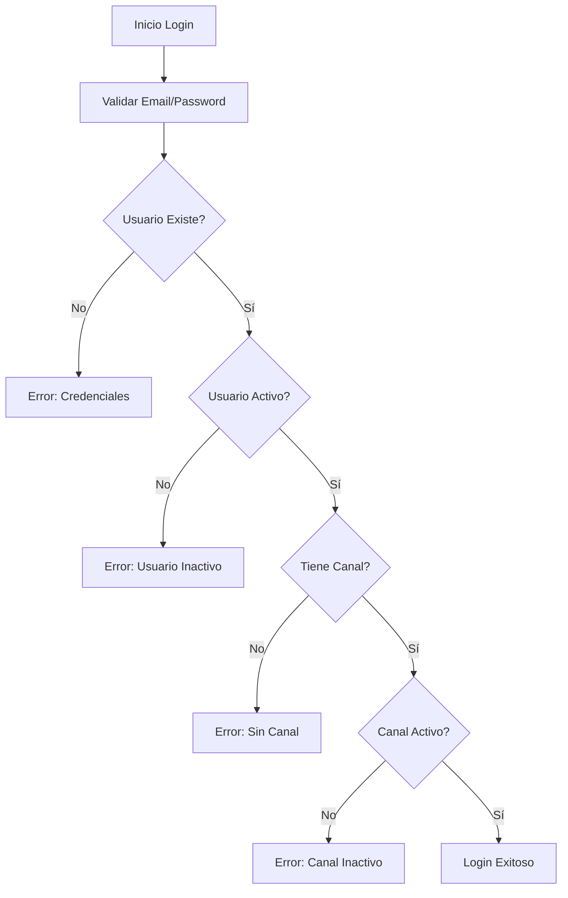

# 🔒 Validación de Canales en el Sistema de Login

## 📋 Descripción

El sistema de login ahora incluye validación del estado activo del canal asociado al usuario. Esto garantiza que solo usuarios con canales activos puedan acceder al sistema.

## 🔧 Validaciones Implementadas

### 1. **Validación del Usuario**

- ✅ Usuario debe existir
- ✅ Usuario debe estar activo (`isActive: true`)
- ✅ Usuario debe tener contraseña válida

### 2. **Validación del Canal** ⭐ **NUEVO**

- ✅ Usuario debe tener un canal asignado (`channel_id`)
- ✅ Canal debe estar activo (`isActive: true`)

## 🚫 Mensajes de Error

| Situación                | Mensaje                                                    |
| ------------------------ | ---------------------------------------------------------- |
| Usuario sin canal        | `"Usuario sin canal asignado. Contacta al administrador."` |
| Canal inactivo           | `"Canal desactivado. Contacta al administrador."`          |
| Usuario inactivo         | `"Cuenta desactivada. Contacta al administrador."`         |
| Credenciales incorrectas | `"Email o contraseña incorrectos"`                         |

## 📊 Flujo de Validación



## 🧪 Pruebas

### Ejecutar Test de Validación

```bash
npm run test:channel-validation
```

Este script:

1. ✅ Crea un canal inactivo
2. ✅ Crea un usuario asociado al canal inactivo
3. ✅ Verifica que el login falle por canal inactivo
4. ✅ Activa el canal
5. ✅ Verifica que el login funcione con canal activo
6. ✅ Limpia los datos de prueba

### Otros Tests Disponibles

```bash
# Probar relación Usuario-Channel
npm run test:user-channel

# Probar conexión a base de datos
npm run db:test

# Probar API de channels
npm run test:channels
```

## 📝 Ejemplo de Respuesta de Login

### Login Exitoso (Usuario y Canal Activos)

```json
{
  "success": true,
  "message": "Login exitoso",
  "user": {
    "_id": "...",
    "first_name": "Edwin",
    "last_name": "David Monge Marin",
    "email": "edwin@example.com",
    "channel_id": "...",
    "channel": {
      "_id": "...",
      "code": "E001",
      "name": "Edwin Contabilidad",
      "ident": "112900656",
      "ident_type": "01",
      "phone": "84383245",
      "phone_code": "506",
      "registro_fiscal_IVA": "112900000",
      "isActive": true
    },
    "role": "user",
    "isActive": true
  }
}
```

### Login Fallido (Canal Inactivo)

```json
{
  "success": false,
  "message": "Canal desactivado. Contacta al administrador."
}
```

## 🔧 Gestión de Canales

### Desactivar Canal

```bash
# Acceder a MongoDB y ejecutar:
db.Channels.updateOne(
  { code: "E001" },
  { $set: { isActive: false } }
)
```

### Reactivar Canal

```bash
# Acceder a MongoDB y ejecutar:
db.Channels.updateOne(
  { code: "E001" },
  { $set: { isActive: true } }
)
```

## ⚠️ Consideraciones Importantes

1. **Impacto en Usuarios**: Al desactivar un canal, TODOS los usuarios asociados a ese canal no podrán hacer login.

2. **Notificación**: Los usuarios recibirán un mensaje claro indicando que deben contactar al administrador.

3. **Trazabilidad**: Todos los intentos de login con canales inactivos se registran en los logs del servidor.

4. **Recuperación**: Para reactivar el acceso, simplemente activar el canal (`isActive: true`).

## 🎯 Beneficios

- ✅ **Control granular**: Gestión por canal de acceso al sistema
- ✅ **Seguridad mejorada**: Previene acceso con canales desactivados
- ✅ **Mensajes claros**: Usuario sabe exactamente qué hacer
- ✅ **Fácil gestión**: Activar/desactivar canales según necesidades del negocio
- ✅ **Trazabilidad**: Logs completos de intentos de acceso
